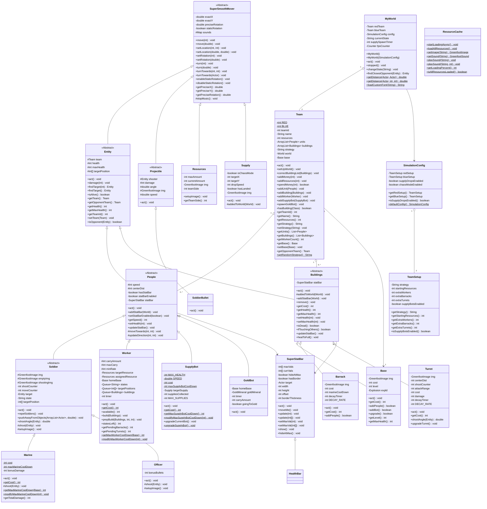

```mermaid
classDiagram

 class SuperSmoothMover <<Abstract>> {
    -double exactX
    -double exactY
    -double preciseRotation
    -boolean staticRotation
    #Map sounds

    +move(int) void
    +move(double) void
    +setLocation(int, int) void
    +setLocation(double, double) void
    +setRotation(int) void
    +setRotation(double) void
    +turn(int) void
    +turn(double) void
    +turnTowards(int, int) void
    +turnTowards(Actor) void
    +enableStaticRotation() void
    +disableStaticRotation() void
    +getPreciseX() double
    +getPreciseY() double
    +getPreciseRotation() double
    #stopMusic() void
  }

  class Entity <<Abstract>> {
    #Team team
    #int health
    #int maxHealth
    #int[] targetPosition

    +act() void
    +damage(int) void
    +findTarget(int) Entity
    +findTarget() Entity
    +isAlive() boolean
    +getTeam() Team
    +getOpponentTeam() Team
    +getHealth() int
    +getMaxHealth() int
    +getTeamId() int
    +setTeam(Team) void
    +isOpponent(Entity) boolean
  }

  class People <<Abstract>> {
    #int speed
    #int centerDist
    -boolean hasStatBar
    -boolean statBarEnabled
    -SuperStatBar statBar

    +act() void
    +addStatBar(World) void
    +setStatBarEnabled(boolean) void
    +getSpeed() int
    +setHealth(int) void
    +updateStatBar() void
    #moveTowards(int, int) void
    #updateDirection(int, int) void
  }

  class Buildings <<Abstract>> {
    -SuperStatBar statBar

    +act() void
    #addedToWorld(World) void
    +addStatBar(World) void
    +remove() void
    +getCost() int*
    +getHealth() int
    +getMaxHealth() int
    +setHealth(int) void
    +setMaxHealth(int) void
    +isDead() boolean
    +ifTouchingOthers() boolean
    +updateStatBar() void
    +healToFull() void
  }

  class Projectile <<Abstract>> {
    #Entity shooter
    #int damage
    #double angle
    #GreenfootImage img
    #double speed

    +act() void
  }

  class Soldier <<Abstract>> {
    #GreenfootImage img
    #GreenfootImage emptyImg
    #GreenfootImage shootingImg
    -int shootCounter
    -int moveCounter
    -Entity target
    -String state
    -int[] targetPosition

    +act() void
    +repelSoldiers() void
    +pushAwayFromObjects(ArrayList~Actor~, double) void
    +shootAngle(Entity) double
    #shoot(Entity) void*
    #setupImage() void
  }

  class SuperStatBar {
    -int[] maxVals
    -int[] currVals
    -boolean hideAtMax
    -boolean hasBorder
    -Actor target
    -int width
    -int height
    -int offset
    -int borderThickness

    +act() void
    +moveMe() void
    +update(int) void
    +update(int[]) void
    +setMaxVal(int) void
    +setMaxVal(int[]) void
    +show() void
    +hideAtMax() void
  }

  class HealthBar

  class Base {
    -GreenfootImage img
    -int cost
    -int level
    -Explosion expld

    +act() void
    +getCost() int
    +addPeople() boolean
    +addBot() boolean
    +upgrade() boolean
    +getLevel() int
    +getMaxHealth() int
  }

  class Barrack {
    -GreenfootImage img
    -int cost
    -int marineCoolDown
    -int decayTimer
    -int DECAY_RATE

    +act() void
    +getCost() int
    +addPeople() boolean
  }

  class Turret {
    -GreenfootImage img
    -int centerDist
    -int shootCounter
    -int attackRange
    -int cost
    -int damage
    -int decayTimer
    -int DECAY_RATE

    +act() void
    +getCost() int
    +shootAngle(Entity) double
    +upgradeTurret() void
  }

  class Worker {
    #int carryAmount
    #int maxCarry
    #int minRate
    -Resources targetResource
    -Resources assignedResource
    -Base homeBase
    -Queue~String~ states
    -Queue~int[]~ targetPositions
    -Queue~Buildings~ buildings
    -int timer

    +act() void
    +getCost() int$
    +available() int
    +build(Buildings) void
    +prepBuild(Buildings, int, int) void
    +statesLeft() int
    +getPendingBarracks() int
    +getPendingTurrets() int
    +getMaxWorkerCoolDown(Base) int$
    +modifyMaxWorkerCoolDown(int) void$
  }

  class SupplyBot {
    -int MAX_HEALTH$
    -double SPEED$
    -int cost$
    -int maxSupplyBotCoolDown$
    -Supply targetSupply
    -int suppliesCollected
    -int MAX_SUPPLIES

    +act() void
    +getCost() int$
    +getMaxSupplyBotCoolDown() int$
    +modifyMaxSupplyBotCoolDown(int) void$
    +upgradeCurrentBot() void
    +upgradeSupplyBot() void$
  }

  class GoldBot {
    -Base homeBase
    -GoldMineral goldMineral
    -int timer
    -int carryAmount
    -boolean goingToGold

    +act() void
  }

  class Marine {
    -int cost$
    -int maxMarineCoolDown$
    -int bonusDamage

    +act() void
    +getCost() int$
    #shoot(Entity) void
    +getMaxMarineCoolDown(Base) int$
    +modifyMaxMarineCoolDown(int) void$
    +getTotalDamage() int
  }

  class Officer {
    -int bonusBullets

    +act() void
    #shoot(Entity) void
    #setupImage() void
  }

  class SoldierBullet {
    +act() void
  }

  class Resources {
    -int maxAmount
    -int currentAmount
    -GreenfootImage img
    -int teamSide

    +setupImage() void
    +getTeamSide() int
  }

  class Supply {
    -boolean isChaosMode
    -int targetX
    -int targetY
    -int dropSpeed
    -boolean hasLanded
    -GreenfootImage img

    +act() void
    #addedToWorld(World) void
  }

  class Team {
    +int RED$
    +int BLUE$
    -int teamId
    -String name
    -int resources
    -ArrayList~People~ units
    -ArrayList~Buildings~ buildings
    -String strategy
    -World world
    -Base base

    +act() void
    +setUpWorld() void
    +correctBuildingList(Buildings) void
    +addMoney(int) void
    +addResources(int) void
    +spendMoney(int) boolean
    +addUnit(People) void
    +addBuilding(Buildings) void
    +addWorker(Worker) void
    +addSupplyBot(SupplyBot) void
    +spawnGoldBot() void
    +hasBuilding(Class) boolean
    +getTeamId() int
    +getName() String
    +getResources() int
    +getStrategy() String
    +setStrategy(String) void
    +getUnits() List~People~
    +getBuildings() List~Buildings~
    +getWorkerCount() int
    +getBase() Base
    +setBase(Base) void
    +getOpponentTeam() Team
    +getRandomStrategy() String$
  }

  class MyWorld {
    -Team redTeam
    -Team blueTeam
    -SimulationConfig config
    -String currentState
    -int supplySpawnTimer
    -Counter fpsCounter

    +MyWorld()
    +MyWorld(SimulationConfig)
    +act() void
    +stopped() void
    +changeState(String) void
    +findClosestOpponent(Entity) Entity
    +getDistance(Actor, Actor) double$
    +getDistance(Actor, int, int) double$
    +loadCustomFont(String) String$
  }

  class SimulationConfig {
    -TeamSetup redSetup
    -TeamSetup blueSetup
    -boolean supplyDropsEnabled
    -boolean chaosModeEnabled

    +getRedSetup() TeamSetup
    +getBlueSetup() TeamSetup
    +isSupplyDropsEnabled() boolean
    +defaultConfig() SimulationConfig$
  }

  class TeamSetup {
    -String strategy
    -int startingResources
    -int extraWorkers
    -int extraBarracks
    -int extraTurrets
    -boolean supplyBotsEnabled

    +getStrategy() String
    +getStartingResources() int
    +getExtraWorkers() int
    +getExtraBarracks() int
    +getExtraTurrets() int
    +isSupplyBotsEnabled() boolean
  }

  class ResourceCache {
    +startLoadingAsync() void$
    +loadAllResources() void$
    +getImage(String) GreenfootImage$
    +getSound(String) GreenfootSound$
    +playSound(String) void$
    +playSound(String, int) void$
    +getLoadingPercent() int$
    +isAllResourcesLoaded() boolean$
  }

  SuperSmoothMover <|-- Entity
  Entity <|-- People
  Entity <|-- Buildings
  SuperSmoothMover <|-- Projectile
  People <|-- Soldier
  Projectile <|-- SoldierBullet
  SuperStatBar <|-- HealthBar
  Buildings <|-- Base
  Buildings <|-- Barrack
  Buildings <|-- Turret
  People <|-- Worker
  People <|-- SupplyBot
  People <|-- GoldBot
  Soldier <|-- Marine
  Soldier <|-- Officer
  SuperSmoothMover <|-- Resources
  SuperSmoothMover <|-- Supply

  Team "1" o-- "0..*" People
  Team "1" o-- "0..*" Buildings
  Team "1" --> "1" Base
  People "0..1" --> SuperStatBar
  Buildings "0..1" --> SuperStatBar

  MyWorld "1" o-- "2" Team
  MyWorld --> SimulationConfig
  SimulationConfig "1" o-- "2" TeamSetup


```
