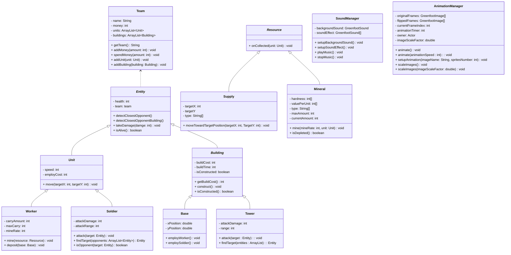

```mermaid
classDiagram

`*Entity*` <|-- `*Unit*`
`*Entity*` <|-- `*Building*`
`*Unit*` <|-- Worker
`*Unit*` <|-- Soldier
`*Building*` <|-- Base
`*Building*` <|-- Tower
`*Resource*` <|-- Supply
`*Resource*` <|-- Mineral
Team <.. `*Entity*`

class Team {
    - name: String
    - money: int
    - units: ArrayList~Unit~
    - buildings: ArrayList~Building~

    + getTeam() String
    + addMoney(amount: int) void
    + spendMoney(amount: int) void
    + addUnit(unit: Unit) void
    + addBuilding(building: Building) void
}

class `*Entity*` {
    - health: int
    - team: team

    + detectClosestOpponent() 
    + detectClosestOpponentBuilding()
    + takeDamage(damge: int) void
    + isAlive() boolean
  }

class `*Unit*` {
    - speed: int
    - employCost: int

    + move(targetX: int, targetY: int) void
}

class Worker {
    - carryAmount: int
    - maxCarry: int
    - mineRate: int

    + mine(resource: Resource) void
    + deposit(base: Base) void
}

class Soldier {
    - attackDamage: int
    - attackRange: int

    + attack(target: Entity) void
    + findTarget(opponents: ArrayList~Entity~) Entity
    + isOpponent(target: Entity) boolean
}

class `*Building*`{
    - buildCost: int
    - buildTime: int
    - isConstructed: boolean
    
    + getBuildCost() int
    + construct() void
    + isConstructed() boolean
}

class Base {
    - xPosition: double
    - yPosition: double

    + employWorker() void
    + employSoldier() void
}

class Tower {
    - attackDamage: int
    - range: int

    + attack(target : Entity) : void
    + findTarget(entities : ArrayList<Entity>) : Entity
}

class `*Resource*`{
    + onCollected (unit: Unit) void
}

class Mineral {
    - hardness: int[]
    - valuePerUnit: int[]
    - type: String[]
    - maxAmount: int
    - currentAmount: int

    + mine(mineRate: int, unit: Unit) void
    + isDepleted() boolean
}

class Supply {
    - targetX: int
    - targetY
    - type: String[]

    + moveTowardTargetPosition(targetX: int, TargetY: int) void
}

class SoundManager {
    - backgroundSound: GreenfootSound
    - soundEffect: GreenfootSound[]

    + setupBackgroundSound() void
    + setupSoundEffect() void
    + playMusic() void
    + stopMusic() void
}

class AnimationManager {
    - originalFrames: GreenfootImage[]
    - flippedFrames: GreenfootImage[]
    - currentFrameIndex: int
    - animationTimer: int
    - owner: Actor
    - imageScaleFactor: double

    + animate() void
    + animate(animationSpeed : int) : void
    + setupAnimation(imageName: String, spritesNumber: int) void
    + scaleImages() void
    + scaleImages(imageScaleFactor: double) void
}


```
